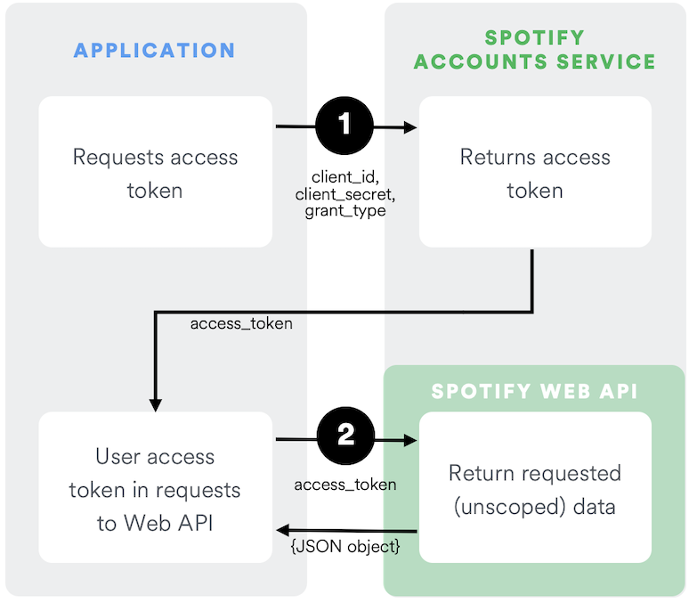
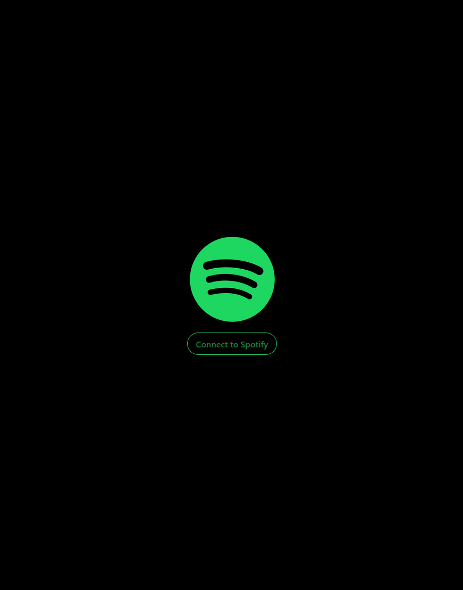
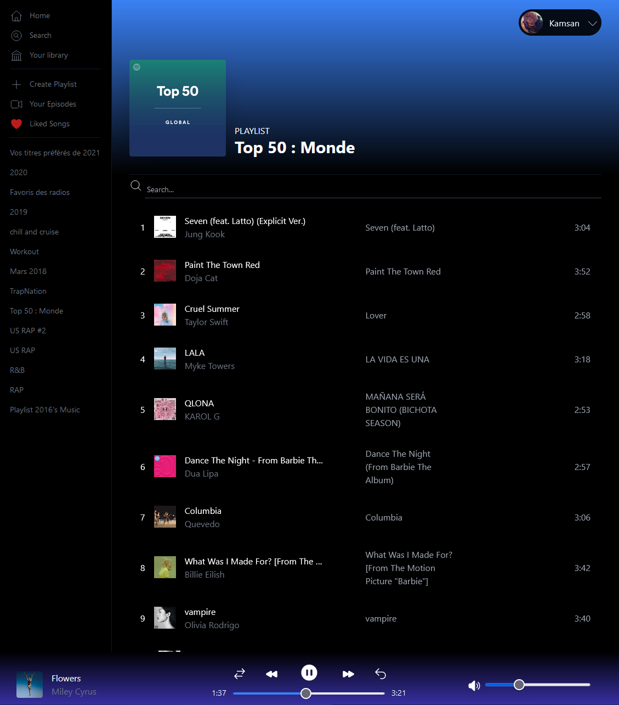
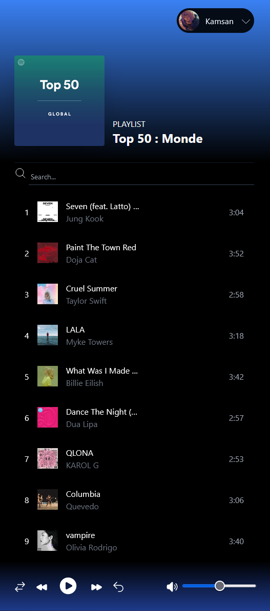

# Spotify

This project is utilizing Angular 16 & the Spotify Web API to fetch and listen to our saved playlists.

Thus, it is taking advantage of the latest features available of the framework like the standalone components, the use of signals and functional guards.

## Tech

This project uses :
- Angular 16
- Typescript
- TailwindCSS

## Spotify Web API

    

## Connexion to Spotify Accounts Service

    

## Application Images

    
    

